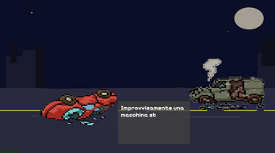
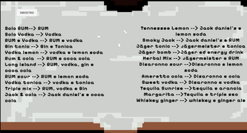
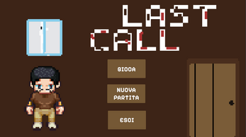
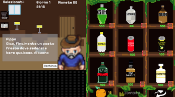
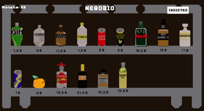
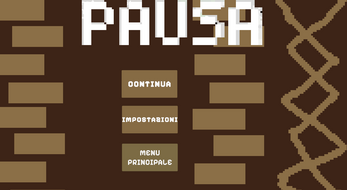
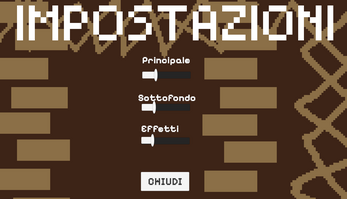

# **Last Call**

### Explanation and introduction:
The game is structured with a main menu that, thanks to a save system, lets you start a new game, continue an existing one, or exit. After that, you go to the first introductory scene of the story and then to the actual gameplay with the bar, the bottles, the customers coming in, the shop system, the coins, the storage, and the recipe book if you don’t know a drink. It will be even better. Everything is accompanied by background music and sound effects, there’s a shop to buy bottles at a fixed price and then put the bottles in storage where duplicates get “detached” like in Minecraft, and a recipe book if a customer orders a drink you don’t know, opening and closing hours from 8 PM to 6 AM that last 10 real minutes, a daily report with how much you spent, how much you earned, customers served and profit so beyond the little story put into the game you also have to manage your bar, a confirm button to give the drink to the customer and a redo button to remake the drink, to earn more money, but be careful because it’s not always worth it depending on how much you have left and how many coins you have, and a pause menu for volume, resuming, and returning to the main menu.

### Download instructions: 
For the download, go to the itch page that’s linked.  https://vittori02-ui.itch.io/last-call  
After that, in front of you you'll have the project page, all you have to do is download the .exe file and from downloads move it to the desktop and you'll be ready to play. As posted on itch, it's a game only for windows pc

### Statement about the use of AI
Also, the use of AI in this project was more of a help to help me realize some ideas and some support in the code for debugging or lack of knowledge. If I had a question, I’d ask how to do it and then handle it myself. For the graphics there are recordings on Lapse.

### Some images
      
